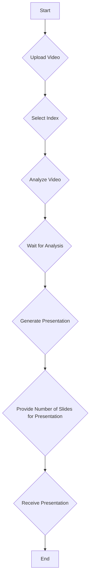

# User Flow

This diagram shows the user's journey through the application.

```mermaid
graph TD
    A[Start] --> B{Upload Video};
    B --> C{Select Index};
    C --> D{Analyze Video};
    D --> E{Wait for Analysis};
    E --> F{Generate Presentation};
    F --> G{Provide Number of Slides for Presentation};
    G --> H{Receive Presentation};
    H --> I[End];
```
