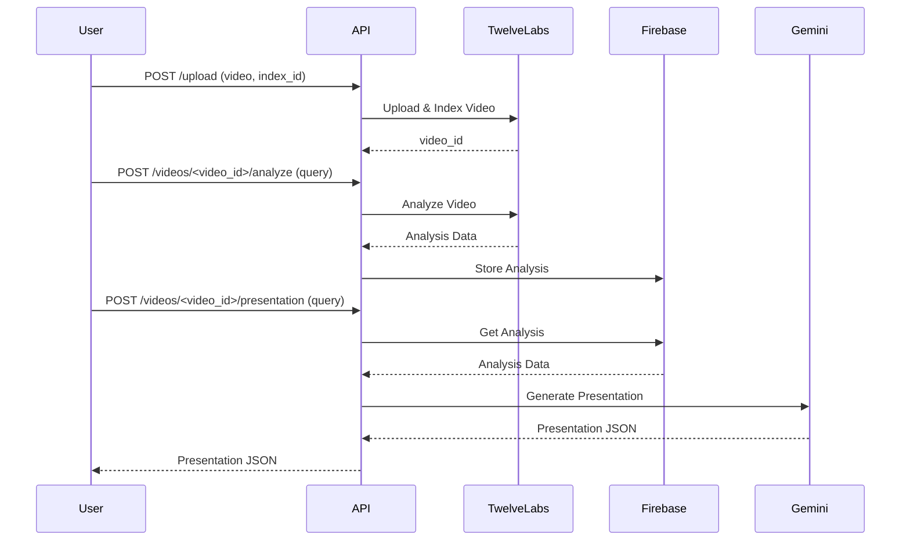

# Workflow

This diagram illustrates the workflow of the application, from video upload to presentation generation.

```mermaid
sequenceDiagram
    participant User
    participant API
    participant TwelveLabs
    participant Firebase
    participant Gemini

    User->>API: POST /upload (video, index_id)
    API->>TwelveLabs: Upload & Index Video
    TwelveLabs-->>API: video_id

    User->>API: POST /videos/<video_id>/analyze (query)
    API->>TwelveLabs: Analyze Video
    TwelveLabs-->>API: Analysis Data
    API->>Firebase: Store Analysis

    User->>API: POST /videos/<video_id>/presentation (query)
    API->>Firebase: Get Analysis
    Firebase-->>API: Analysis Data
    API->>Gemini: Generate Presentation
    Gemini-->>API: Presentation JSON
    API-->>User: Presentation JSON
```
